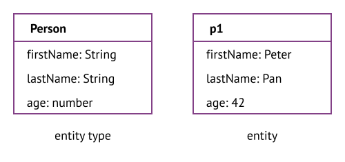

## Introduction

- models data as entities and relationships
- closer to real world than other models ???
- mainly used for database schemas

## Definitions  

- entity: individual thing that exists, e.g. concrete person, physical address, JavaScript object, etc.
- attribute: individual property of an entity, characterises the entity, e.g. concrete age of concrete person
- relationship: individual relation of multiple entities, e.g. concrete person has concrete birthday
- entity type: abtract notion of the type of an entity, e.g. a person, an address, a JSON schema, etc.
- attribute type: abtract notion of the type of an attribute, characterises the entity type, e.g. the age of a person
- relationship type: abstract notion of the type of a relationship, e.g. a person has a birthday
- beware: often entity, attribute, relationship are used as synonym for their types ❗️
- an entity is an instance of its entity type, e.g. an object is an instance of its object type
- similarly an attribute is an instance of its attribute type, a relationship is an instance of its relationship type

## ER diagram

- diagram of entity types with their attribute types and their relationship types, usually drawn as boxes and lines
- beware: the diagram is drawn for the abstract types, it really "exists" only for the concrete instances ❗️

- can think of entity types as nouns and relationship types as verbs, e.g. person owns car, car is owned by person
- beware: a relationship label can be read in one direction only, the other direction is obtained by turning the verb into passive voice
- beware: label a relationship with a verb in active voice instead of passive, otherwise can't express the reverse relationship type ❗️
- entity types and relationship types have each a label, e.g. "Person" "has" "Birthday"
- entity types and relationship types can both have attribute types, relationship is first-class citizen, e.g. relationship type `created` with attribute type `when: Date`
- attribute types can be drawn in separate boxes connected to entity type, here we draw them directly on the entity type like object properties

## Cardinality of a relationship type

- number of _instances_ of the second entity type that one _instance_ of the first entity type can have the given relationship with, e.g. a person (instance) can own multiple books (instance)
- cardinality can be determined for each entity in a relationship, may very well have different cardinalities, e.g. a person (instance) has one birthday (instance), one birthday (instance) can be had by multiple people (instances)
- cardinality is notated at the end of the line close to the other entity
- usually uses Martin-notation: a ring represents `0`, a vertical dash represents `1`, a crow's foot represents `more`, can be expressed in letters as `o`, `|`, `{` / `}` (depending on direction)
- always combines two symbols, the inner component represents the minimum, the outer component represents the maximum, from the point of view of the given entity
- makes only sense for the following combinations: the symbol `||` means exactly one, `o{` means zero or more, and `|{` means one or more, for cardinality from left entity to right

- beware: if wants to be able to version the data, needs to keep the cardinality of a relationship at one and have many duplicated entities with the same content, instead of having a single entity that many otherwise unrelated entities link to, e.g. `Person ||has|| Birthday`, `Person ||has|| Age`, `Person ||has|| Address`, `Person ||has|| Nationality`, instead of `}|has||` or `Person ||has|{ Book` instead of `}|has|{` etc. ⚠️

## Database schema

- structure of data
- often modeled using ER model, i.e. fixed structure of entity types, relationship types, attribute types
- implemented using constraints
- used to give data a predictable structure
- not every database needs to have a schema although often useful, e.g. graph databases
- beware: using an ER model doesn't imply database needs to have schema ❗️

## Resources

- [Wikipedia - Entity–relationship model](https://en.wikipedia.org/wiki/Entity%E2%80%93relationship_model)
- [Mermaid - Entity Relationship Diagrams](https://mermaid-js.github.io/mermaid/#/entityRelationshipDiagram)