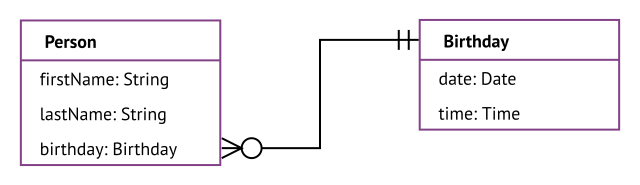
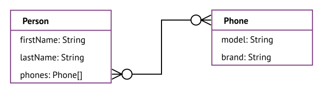

## Relational database

- ???
- not good to store relationships, even though their name contains "relation"

- each row of the table represents one entity of the same entity type, has a unique identifier (primary key)
- each field in the table represents an attribute
- relationships between entities of different entity types are implicitly implemented by storing the ID (primary key) of one entity as a pointer (foreign key) in the table of the other entity, no explicit relationships, i.e. relationships can't have attributes
- only attributes of an entity can have relationships, since they can contain a pointer to other entities, e.g. the person entry uses one birthday entry, while the birthday entry can be used by multiple person entries

- the relationship can be labeled "uses", is usually not labeled since it is always the same
- the cardinality of a relationship of an attribute must be at least one, otherwise the attribute would be empty, if the cardinality is higher than one, the attribute must be an array, since it can contain multiple instances ❗️

## Object database

- stores information in the form of objects, as opposed to tables like relational databases
- an object is one entity, has a unique identifier
- a property is an attribute, can be an object if it doesn't link to it
- relationships between entities of different entity types are still implemented by storing the ID of one entity in the attribute of the other entity, i.e. like relational database